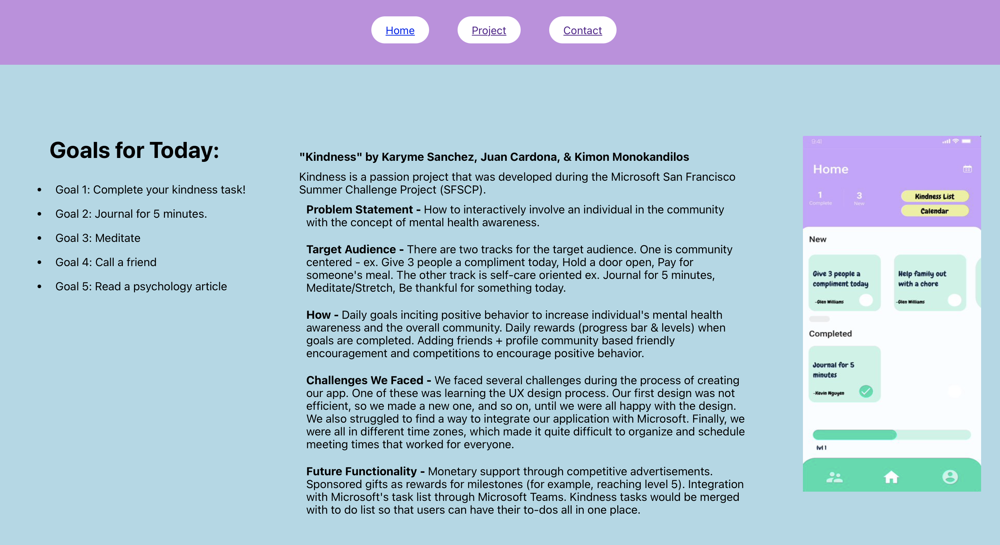
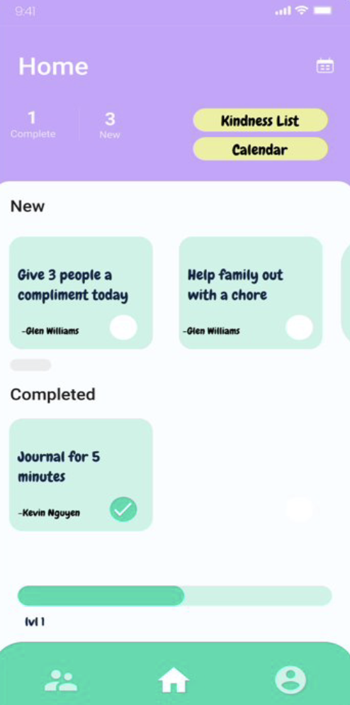

# Kindness by Karyme Sanchez, Juan Cardona, and Kimon Monokandilos. 🪴 

Kindness provides daily goals in order to spread awareness about mental health and well-being. The project was developed during Microsoft's San Francisco Summer Challenge project.

Desktop version:



Mobile version:



## Technologies


## Instructions

### Front-end (React)
To run the React front-end locally, follow these steps:

1. Navigate to the front-end directory.
   ```bash
   cd frontend

2. Install the necessary dependencies.
   ```bash
   npm install 

3. Start the front-end react server.
   ```bash
   npm start

The front-end will be accessible at http://localhost:3000.

### Back-end (Ruby on Rails)
To run the Ruby on Rails back-end locally, follow these steps:

1. Navigate to the back-end directory.
   ```bash
   cd backend

2. Install the necessary dependencies.
   ```bash
   bundle install 

3. Start the Rails server on port 3001.
   ```bash
   rails server -p 3001

The back-end will be accessible at http://localhost:3001.
